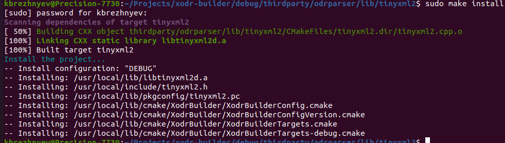
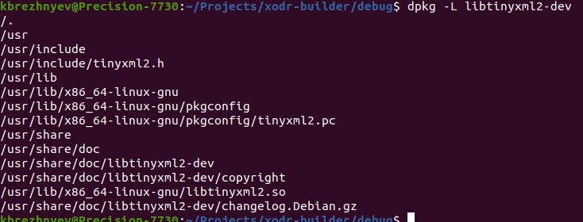
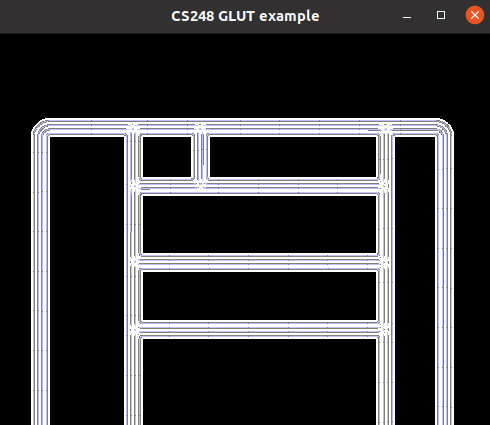

# Xodr Builder

Parsing and building the boarders (lanes) and centers of lanes from XODR files.

## Getting started

To clone and build the project:
1. In your Projects folder clone the project: *git clone --recurse-submodules https://git.altran.de/adas/xodr-builder.git*
1. Inside the xodr-builder folder: *mkdir debug && cd debug* (otherwise *mkdir release && cd release*) or use whaterver build directory you prefer.
2. *cmake .. -DCMAKE_BULD_TYPE=DEBUG* (otherwise *cmake .. -DCMAKE_BUILD_TYPE=RELEASE*)
3. *make install*. Be aware that installing with make will copy some of the files (libs, headers) into /usr/local.. folder.
**Known issues: make uninstall does not work properly now.** For proper build of your client applications you will need the tinyxml2 package installed on your system. You can install it from the thirdparty/odrparser/lib/tinyxml2 with *make install*. Alternatively the package can already be present on your system - for example ROS framework installs tinyxml-dev and is dependend from it. Double check the installation paths. In this case you dont need to extra install the tinyxml2:
 
compare with location of existing tinyxml2 (if any): 
 
The tinyxml2 is having known issues with some C functions (sscanf and atof) running on **Del Precision** notebooks. For this reason the tinyxml2.cpp from the root will replace the one in the odrparser/lib/tinyxml2 folder and will be used to build the static library.
 
4.The example folder has one demo of the XodrBuilder client application. Change the folder (*cd example*) and run the example: *./glut_example*: 

